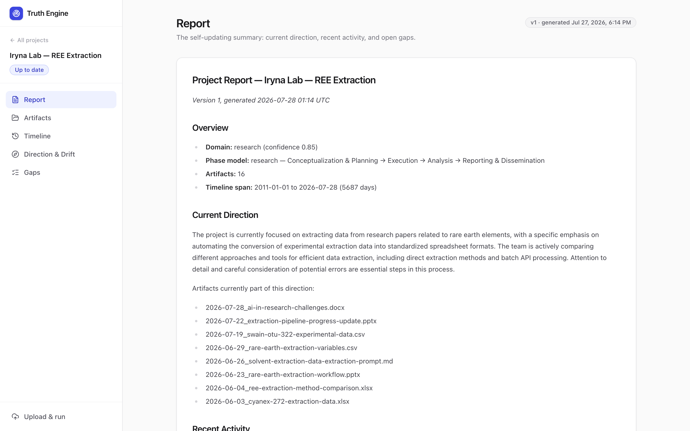
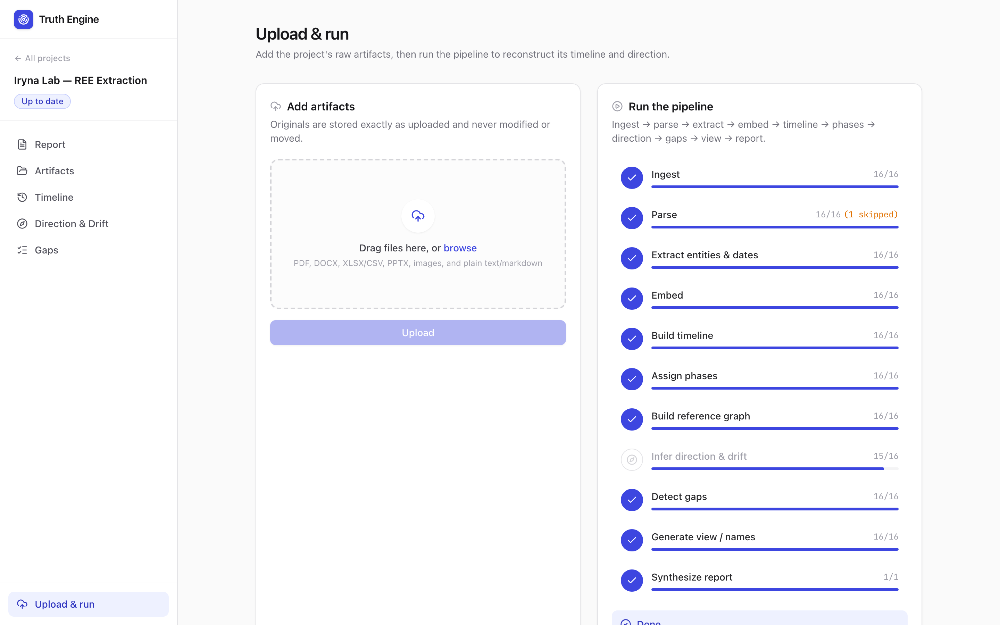
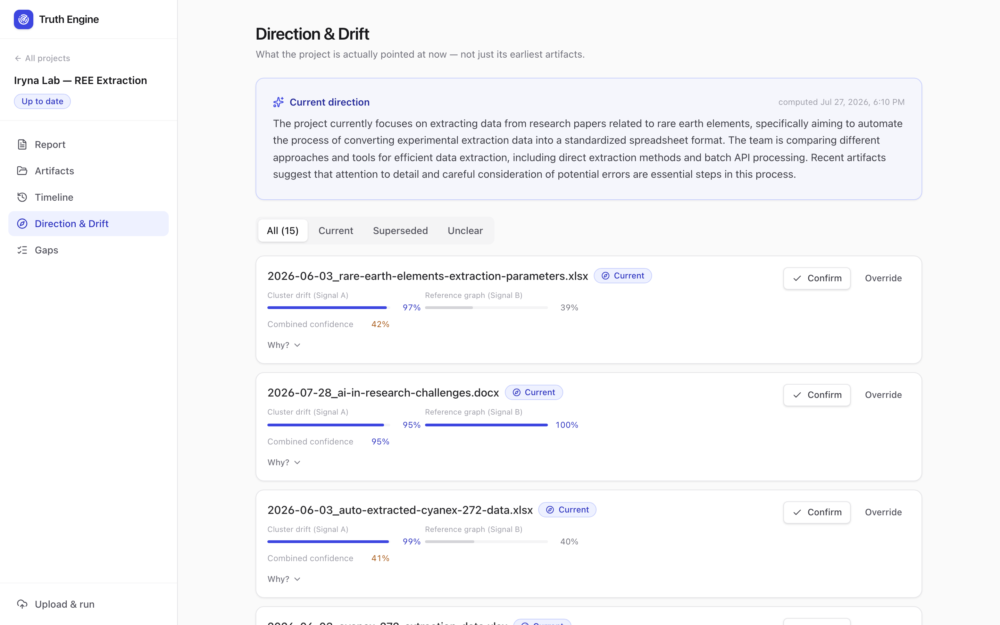
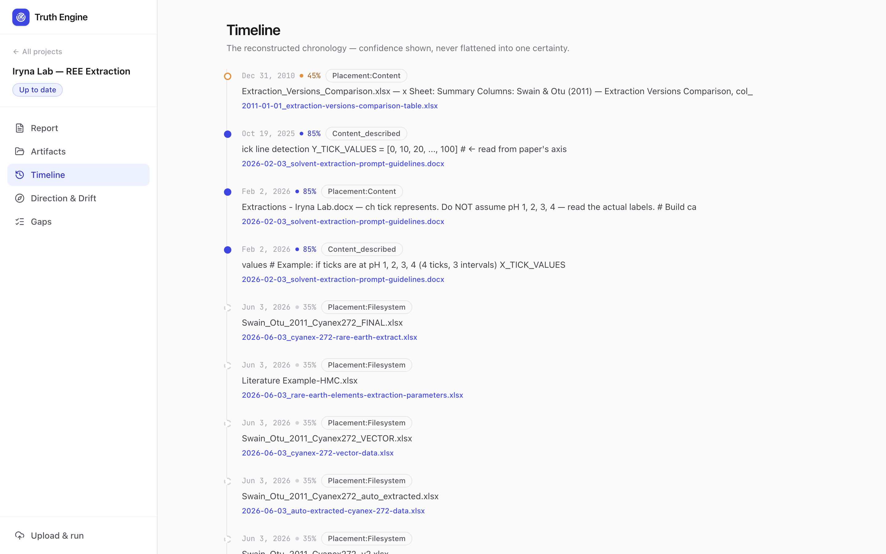
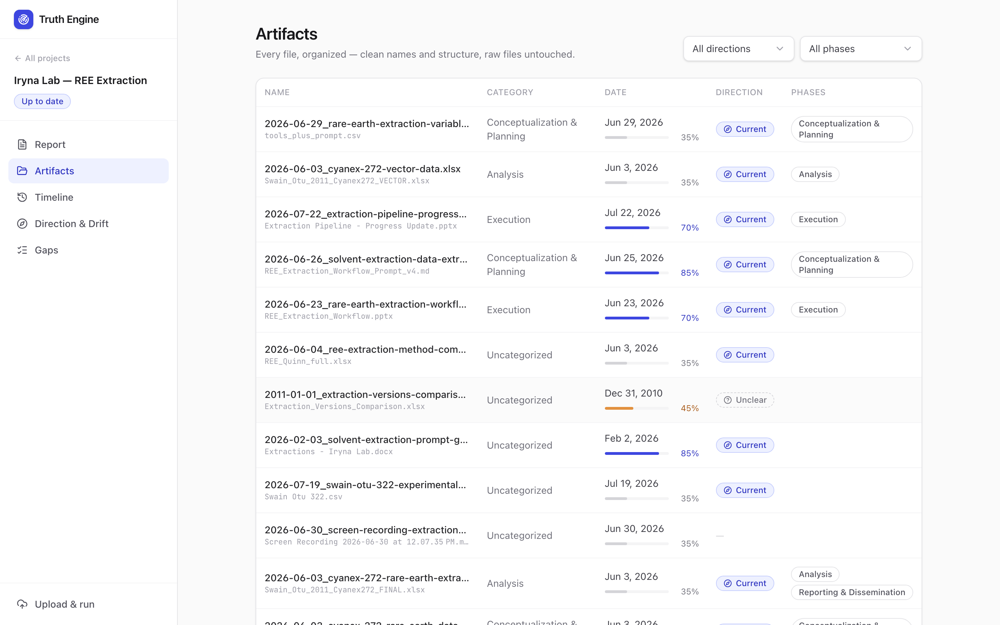

# Project Truth Engine

[](https://github.com/NicholasHat/project-steward/actions/workflows/ci.yml)
[](LICENSE)
[](pyproject.toml)

Point it at a messy folder of project files (PDFs, spreadsheets, notes, slide decks, images) and it reconstructs the project: what happened, in what order, what's missing, and where the project's direction has drifted from where it started.



## What it does

- **Browse every artifact** through one clean index, without touching the original files.
- **Timeline with gaps** — a reconstructed chronology that flags missing phases and expected-but-absent artifacts.
- **Direction and drift** — each artifact is labeled `current`, `superseded`, or `unclear`, with a rationale you can open and inspect.

It runs an 11-stage pipeline end to end: ingest, parse, extract, embed, timeline, phases, graph, direction, gaps, view, report. A React dashboard drives it over an HTTP API, or you can run each stage from the CLI.

## Screenshots

The pipeline and the direction/drift view, from the sample run above:

| Pipeline run | Direction & drift |
|---|---|
| [](docs/img/pipeline.png) | [](docs/img/direction.png) |
| Every stage, with an unsupported file skipped (not failed). | Per-artifact `current`/`superseded`/`unclear`, two signals, human confirm/override. |

| Timeline | Artifacts |
|---|---|
| [](docs/img/timeline.png) | [](docs/img/artifacts.png) |
| Reconstructed chronology, confidence and source per date. | One index over every file, with suggested names and dates. |

## Design invariants

- **Deterministic parsing and extraction.** A general-purpose LLM never reads raw files. LLM reasoning is used only for judgment calls: direction, drift, gaps, renaming, report.
- **Auditable.** Every inferred fact traces back to the source artifacts and the signals behind it.
- **Reversible.** No automated action is permanent. A human confirmation gates anything that acts on drift labels, and originals are never modified or moved.
- **Private by default.** Local embeddings and a local LLM. Ingested content stays on the host.
- **Multi-user.** Every project is owner-scoped; users see only their own data.
- **Config-driven verticals.** Add a domain by adding rows to `PhaseTemplate` (see `db/seed.py`), not by writing code.

## Tech stack

Python 3.12 · FastAPI · PostgreSQL 16 + pgvector · SQLAlchemy 2.0 + Alembic · `nomic-embed-text` embeddings via Ollama (768-dim, 8192-token context) · local reasoning LLM via Ollama, with an adapter for a hosted model · React + Vite + Radix/shadcn dashboard · Docker Compose + Caddy for self-hosting.

One store: Postgres + pgvector holds structured data, the relationship graph, audit history, and the embeddings. No separate vector database.

## Local development

Backend:

```bash
uv sync --extra dev                 # venv + core + dev deps (add --extra pipeline for parsing/ML)
docker compose up -d db             # Postgres + pgvector on localhost:5433
cp .env.example .env                # set TRUTH_DATABASE_URL host to localhost:5433
uv run alembic upgrade head         # apply schema (also creates the vector extension)
uv run python -m truth_engine.db.seed   # seed phase templates
uv run uvicorn truth_engine.api.app:app --reload   # http://localhost:8000
```

Frontend:

```bash
cd frontend && npm install && npm run dev   # http://localhost:5173
```

Tests and lint:

```bash
uv run ruff check src alembic tests
uv run pytest                       # runs against the migrated dev DB
```

To change the schema: edit `src/truth_engine/db/models.py`, then `uv run alembic revision --autogenerate -m "message"` and review the migration (see `CLAUDE.md` for the required hand-fixups).

## Deployment (self-hosted)

Self-hosted means the whole system runs on a box you control. In the default config nothing is sent to a third-party inference API.

1. **Server** — a cloud VM (Hetzner / DigitalOcean / EC2, ~$5–40/mo on CPU) or your own machine, with Docker installed.
2. **Configure** — `cp .env.example .env`, set `TRUTH_SECRET_KEY` to a random value and `SITE_ADDRESS` to your domain. Point the domain's DNS at the server.
3. **Launch** — `docker compose up -d`. This starts FastAPI, Postgres/pgvector, Ollama, and Caddy. Caddy provisions HTTPS via Let's Encrypt.
4. **Pull the models**:
   ```bash
   docker compose exec ollama ollama pull nomic-embed-text
   docker compose exec ollama ollama pull llama3.1:8b   # skip if TRUTH_LLM_PROVIDER=anthropic
   ```
5. The app is reachable at your domain. Ingested data lives only in the `pgdata` and `artifacts` volumes.

### Compute cost

The two local models cost very different amounts to host:

- **Embeddings** (`nomic-embed-text`, ~0.3 GB) run fine on CPU, so a $5–20/mo VPS is enough. This layer sees raw document text, which is why keeping it local is the core of the privacy story.
- **The reasoning LLM** (direction, drift, gaps, renaming, report) is the expensive part. Apple Silicon runs a 7B+ model for free; a CPU-only cloud VM runs the same model slowly.

So the production choice is per-environment:

- **(a) GPU host, everything local** — no egress, higher infra cost (uncomment the GPU block in `docker-compose.yml`), or
- **(b) cheap CPU box, hosted reasoning LLM** — set `TRUTH_LLM_PROVIDER=anthropic` and `TRUTH_ANTHROPIC_API_KEY`. Embeddings and parsing stay local, so raw document text never leaves the box; only extracted, summarized signal goes to the API. Given the spec treats raw content as sensitive, (b) is the pragmatic default.

## Roadmap and known limitations

- **Pipeline runs are in-process** (FastAPI `BackgroundTasks`). A worker crash mid-run leaves an orphaned `running` row; a startup sweep reconciles those to `error` on the next boot. A real job queue (heartbeats, cross-process resumption) is the next upgrade.
- **Phase assignment uses an LLM**, so which phase an artifact lands in can vary run to run. The domain classification and structural gaps are deterministic.
- **NER runs on `en_core_web_sm`** by default. `en_core_web_trf` is a config swap (`TRUTH_SPACY_MODEL`) that improves entity quality at the cost of a torch dependency and slower inference — better as a production profile.
- **Unsupported formats** (e.g. video) are retained and dated on the timeline but not analyzed.

## Docs

- [`PROJECTSPECS.md`](PROJECTSPECS.md) — the product spec (the "why").
- [`CLAUDE.md`](CLAUDE.md) — engineering conventions, schema invariants, and gotchas.
